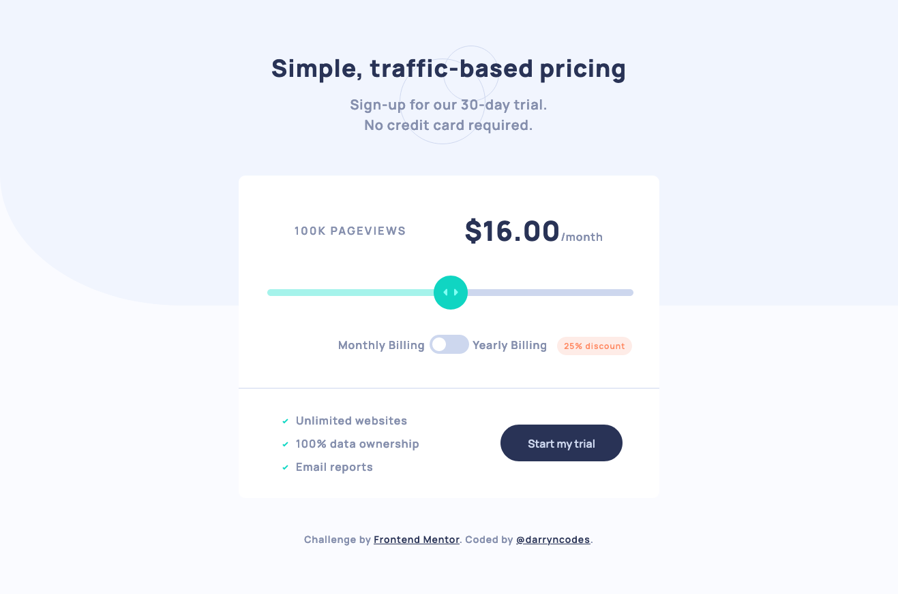

# Frontend Mentor - Interactive pricing component solution

This is a solution to the [Interactive pricing component challenge on Frontend Mentor](https://www.frontendmentor.io/challenges/interactive-pricing-component-t0m8PIyY8). Frontend Mentor challenges help you improve your coding skills by building realistic projects.

## Table of contents

- [Overview](#overview)
  - [The challenge](#the-challenge)
  - [Screenshot](#screenshot)
  - [Links](#links)
- [My process](#my-process)
  - [Built with](#built-with)
  - [What I learned](#what-i-learned)
  - [Continued development](#continued-development)
  - [Useful resources](#useful-resources)
- [Author](#author)

## Overview

### The challenge

Users should be able to:

- View the optimal layout for the app depending on their device's screen size
- See hover states for all interactive elements on the page
- Use the slider and toggle to see prices for different page view numbers

### Screenshot

### Links

- [GitHub repo](https://github.com/darryncodes/interactive-pricing-component)
- [Solution URL](https://darryncodes.github.io/interactive-pricing-component/)

## My process

### Built with

- Semantic HTML5 markup
- SCSS
- JS
- Flexbox
- CSS Grid
- Mobile-first workflow
- BEM methodology

### What I learned

- How to style html range inputs and create toggles from check boxes
- Working with arrays, looping over objects and accessing key value pairs

### Continued development

- Improving quality of commit messages in GIT
- JS fundamentals - working with arrays, logic and flow control

### Useful resources

- [w3schools - range slider](https://www.w3schools.com/howto/howto_js_rangeslider.asp)
- [w3schools - toggle switch](https://www.w3schools.com/howto/howto_css_switch.asp)
- [JavaScript forEach – How to Loop Through an Array in JS](https://www.freecodecamp.org/news/javascript-foreach-how-to-loop-through-an-array-in-js/)
- [How to Use forEach() to Iterate an Array in JavaScript](https://dmitripavlutin.com/foreach-iterate-array-javascript/)
- [MDN - Array.prototype.forEach()](https://developer.mozilla.org/en-US/docs/Web/JavaScript/Reference/Global_Objects/Array/forEach)

## Author

- Work in progress portfolio site - [@darryncodes](https://www.darryncodes.co.uk/)
- Frontend Mentor - [@darryncodes](https://www.frontendmentor.io/profile/darryncodes)
- Twitter - [@darryncodes](https://twitter.com/darryncodes)
